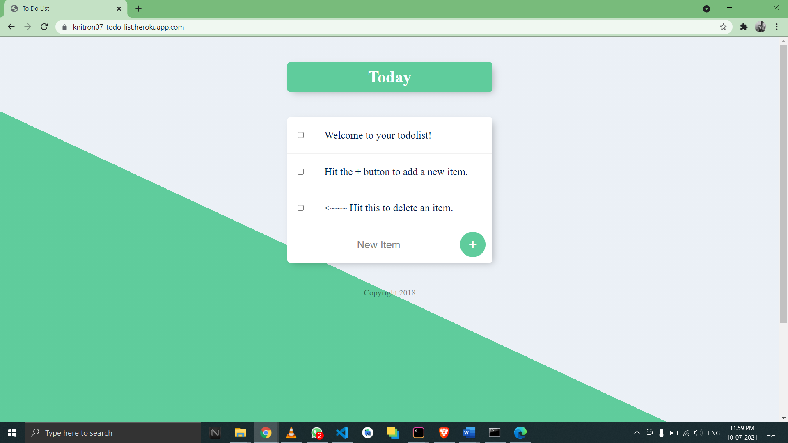
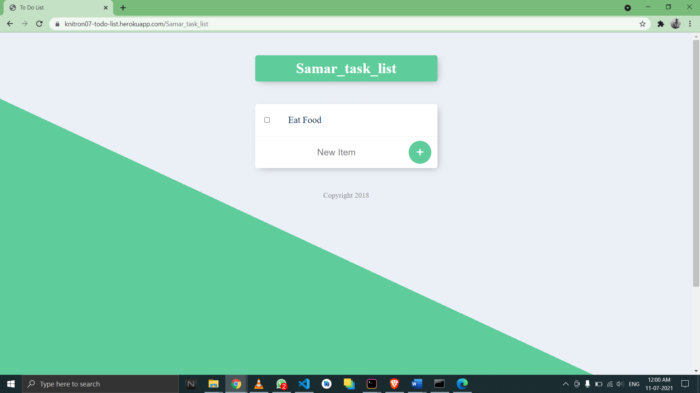

# todolist


It's a website where user can make their custom task list .


## Installation

```bash
  cd <File_location>/todolist_by_knitron07
  npm i
  nodemon app.js
```
## Features
- Here user can make own custom task list by hitting "/<CUSTOM_TASK_NAME>".
- Add any task that you have to perform
- Delete completed task.

  
## Screenshots






  
